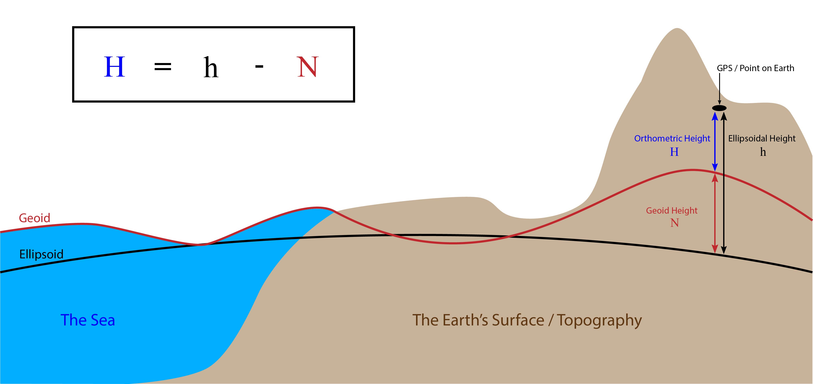

# Georeferencing

>

https://www.buildingsmart.org/wp-content/uploads/2020/02/User-Guide-for-Geo-referencing-in-IFC-v2.0.pdf

## To Be Figured Out

Ways to define a geodetic datum for an Engineering CRS:

* Lon, Lat, Elipsoid Height, Angle to True North
* Easting, Northing, Orthometric Height, Angle to Grid North
* Survey Points

## Definition of a Coordinate Reference System (CRS)

Sources:

* https://www.fao.org/cwp-on-fishery-statistics/handbook/general-concepts/spatial-reference-systems
* https://www.crs-geo.eu/definition-crs.htm
* https://www.deparentis.com/wp-content/uploads/2020/04/IGOP-373-05.pdf

A Coordinate Reference System contains two different elements - the datum and the coordinate system.

The datum defines how the CRS is related to the earth (position of the origin, the scale and the orientation of coordinate axis) e.g. ED50, ETRS89 and the coordinate system describes how the coordinates expressed in the datum e.g. as cartesian coordinates, ellipsoidal coordinates or coordinates of a map projection e.g. UTM.

## Linear Infrastructure CRS'es

When designing a linear infrastructure alignment (such as a road, railway, or pipeline) that crosses from one zone to another in a national grid system, specific procedures must be followed to ensure consistency, accuracy, and minimal distortion.

The best approach depends on project length, accuracy requirements, and software capabilities. For shorter crossings, extending a single zone works well. For longer projects, either the project has to be split at the national grid boundary or a project specific custom projected CRS has to be created.

The process typically involves the following steps:

1. Selection of a Suitable Coordinate Reference System (CRS)
Identify the primary CRS used for the project, which is often based on the national grid system (e.g., UTM, Gauss-Krüger, or Lambert).
If the alignment is entirely within one zone, use that zone’s CRS.
If the alignment crosses multiple zones, a strategy for transition must be defined.

2. Defining the Transition Strategy Between Zones  
    Option 1: Stay in One Zone (Extend the Zone Limits)  
    If the alignment does not extend far into the next zone, the design can remain in the first zone, treating coordinates from the second zone as extended. This avoids transformations but can introduce slight distortions.

    Option 2: Split at the Zone Boundary  
    The alignment is designed in two separate coordinate systems, each following its respective zone.
    At the boundary, a coordinate transformation (datum shift) is applied to ensure consistency.
    This approach is useful when the infrastructure spans large distances across zones.

    Option 3: Use a Custom Local CRS (Best for Long Alignments)  
    A project-specific oblique Mercator or Transverse Mercator projection is created to cover the entire alignment without switching zones.
    This is commonly used for railways and highways to avoid repeated coordinate transformations.

3. Coordinate Transformation and Adjustment
When switching zones, perform a coordinate transformation using geodetic software (e.g., PROJ, ArcGIS, or QGIS).
Apply Helmert transformations or grid-based transformations if necessary.
Ensure continuity of coordinates along the alignment, avoiding sudden shifts.

4. Ensuring Engineering Consistency
Perform geodetic checks to ensure:
Distances and bearings remain accurate.
There is no unexpected distortion in alignment.
Convert elevation data to the appropriate vertical reference system.

5. Integration with GIS and CAD Software
Use specialized software like Civil 3D, MicroStation, or OpenRoads to maintain accurate coordinates.
Implement dynamic referencing so that design elements adjust automatically when shifting between zones.

6. Validation and Quality Control
Perform benchmark testing at critical points along the alignment.
Cross-check GIS and survey data against real-world measurements.
Ensure all stakeholders (engineers, surveyors, GIS teams) agree on the approach.

### Surveying Best Practice for Linear Infrastructure Projects

* Survey is initially done in (Longitude, Latitude, Ellipsoidal Height) using GNSS.
* Survey data is transformed to the National Grid CRS (Easting, Northing, Orthometric Height).
* If a Custom Project CRS is used, points are transformed from the National Grid CRS to the Custom CRS.

## Heights...

## National Grid systems

* United States – State Plane Coordinate System (SPCS)
* Canada – UTM-based National Topographic System (NTS)
* Russia – Gauss-Krüger Coordinate System
* Germany – Gauß-Krüger Coordinate System
* Sweden – RT90 (Rikets koordinatsystem 1990)
* United Kingdom – Ordnance Survey National Grid (OSGB36)
* France – Lambert Zones (NTF Lambert 1–4)

## Definitions

* Coordinate Cystem (CS)
* Spatial Refence System (SRS) / Coordinate Reference System (CRS) = CS + datum
* Datum
