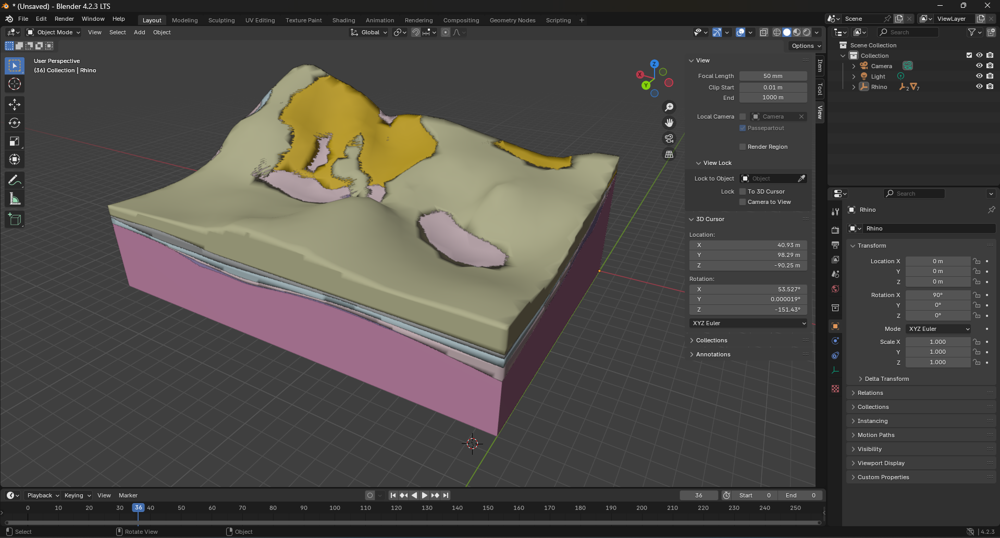

# Workflow

1. Leapfrogmodel
2. Export to CAD (.dwg or .dxf)
3. Open Ground Model CAD in Rhino
   1. Send to Speckle
   2. Export to [`.usd`](../Geotech/LeapFrogGroundModel.usd), [`.usda`](../Geotech/LeapFrogGroundModel.usda), [`.usdz`](../Geotech/LeapFrogGroundModel.usdz)

# Leapfrog Ground Model Visualizations

## Speckle

<iframe title="Speckle" src="https://app.speckle.systems/projects/7a489ac0d4/models/3d1846339d#embed=%7B%22isEnabled%22%3Atrue%7D" width="600" height="400" frameborder="0"></iframe>

## USD

Figure out how to display a USD in a markdown file or embed a USD visualization in e.g. a [quarto](https://quarto.org/) web page.

### Import USD in Blender

